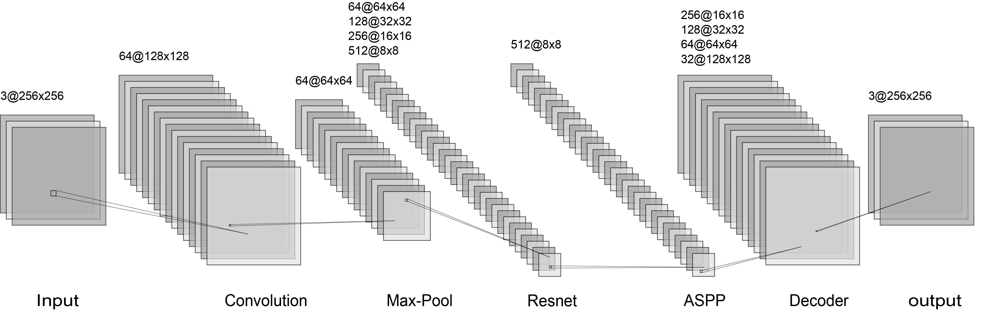
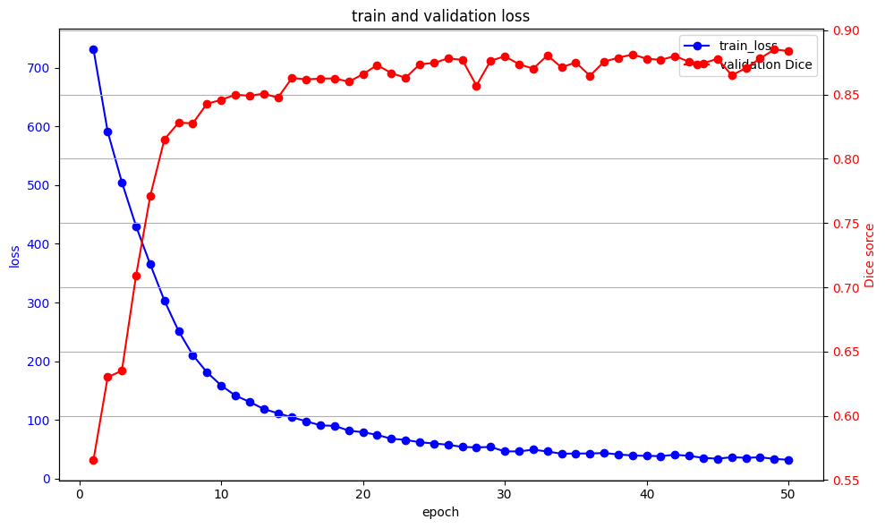
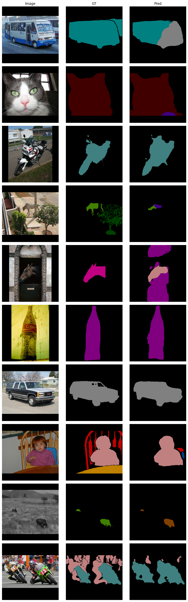

# Semantic Segmentation 基于改进的ResNet-U-Net

大学牲的CV课程实验🥲，基于ResNet改进U-Net，深度监督、融合注意力机制和ASPP模块，实现多类别语义分割。

## 特点

- 基于ResNet的编码器，增强特征提取能力
- 引入注意力机制，聚焦重要特征区域
- 集成ASPP模块，提升多尺度目标处理能力
- 深度监督，学习多层次特征
- 图像增强

## 文件结构
```
├── ResNet_Semantic_Segmentation.ipynb   # 主代码文件，包含模型构建与训练流程
├── voc-pascal-2012-segmentation         # 数据集文件夹
│     ├── JPEGImages                     # 数据集图片文件夹
      ├── mask                           # mask图片文件夹
      ├── train.txt                      # 训练集索引
      ├── valid.txt                      # 验证集索引
├── README.md                            # 项目说明文档
└── best.pth                             # 模型                           
```

## 网络结构


## 成果demo





## 环境依赖

- Python 3.x
- Jupyter Notebook
- PyTorch >= 1.7
- torchvision
- numpy
- matplotlib
- ...


